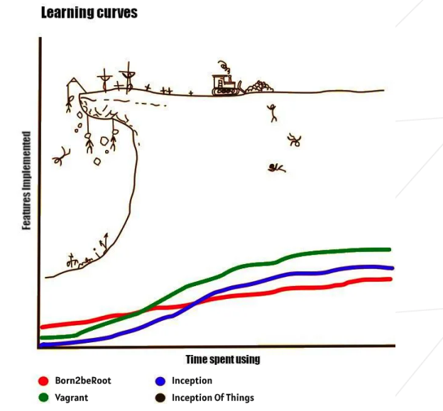

# Inception-of-thing

This project aims to deepen your knowledge by making you use K3d and K3s with Vagrant.

You will learn how to set up a personal virtual machine with Vagrant and the
distribution of your choice. Then, you will learn how to use K3s and its Ingress.
Last but not least, you will discover K3d that will simplify your life.

## Sources

[Official Documentation Vagrant (EN)](https://developer.hashicorp.com/vagrant/docs)

[Apprendre et Maitriser Vagrant (FR)](https://blog.stephane-robert.info/post/introduction-vagrant/#installation-de-vagrant)

[Vboxmanage Documentation (EN)](https://www.virtualbox.org/manual/ch08.html#vboxmanage-unregistervm)

[SSH login without password (EN)](http://www.linuxproblem.org/art_9.html)

